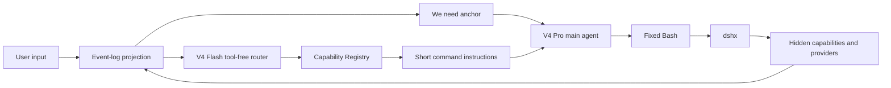

<p align="center">
  <strong>oh-my-dsh</strong>
</p>

<h1 align="center">A fixed Minimal surface with on-demand capabilities</h1>

<p align="center">DeepSeek Harness preset · Native MSYS2 Bash on Windows · V4 Flash capability routing</p>

<p align="center">
  <a href="README.zh-CN.md">中文</a> ·
  <a href="docs/plan.md">Development plan</a> ·
  <a href="codemap.md">Repository map</a> ·
  <a href="NOTICE">NOTICE</a>
</p>

oh-my-dsh is an experimental DeepSeek Harness preset. It keeps the main agent on the official Minimal persona and a stable tool surface while moving Windows Bash, capability registration, Flash routing, and long-running recovery into the runtime layer. When the main agent needs an extra capability, it still uses Bash and `dshx`; the complete Standard catalog is not exposed to the model.

## Project positioning

The runtime is organized around one stable model-facing contract:

| Part | Responsibility |
| --- | --- |
| Minimal model plane | Keeps the official persona, fixed base tools, and request prefix stable. |
| Session Event Log | Stores user, plugin, queued, steering, resume, routing, and subagent facts. |
| Orchestration plane | Lets a tool-free V4 Flash sub-agent select capability IDs and produce short command instructions. |
| Execution plane | Uses the Harness Bash provider on Linux and persistent MSYS2 stdio Bash on Windows. |
| WebUI | Keeps the native DeepSeek Harness WebUI for both source and packaged runs. |

The main agent normally sees three tools:

| Tool | Purpose |
| --- | --- |
| `bash` | Persistent Bash terminal. |
| `str_replace_editor` | Official Minimal file-editing contract. |
| `web_search` | Resident web search. |

Tauri is only the Windows resource packager, launcher, and installer entry point. It does not provide a second headless conversation surface or replace the DeepSeek Harness WebUI.

## Upstream and reused contributions

This project is forked from [xiaobright/dsh-anchored-standard](https://github.com/xiaobright/dsh-anchored-standard). The upstream contribution includes the validated Minimal persona, fixed tool contract, anchoring approach, and comparison preset. This repository reuses that foundation and extends it with event-log state derivation, the Windows MSYS2 execution layer, the capability registry, V4 Flash routing, long-running recovery, and Tauri release packaging.

`zero-anchored-standard/` remains the historical comparison path; the current default implementation is under `preset/`. Original upstream copyright and third-party notices remain covered by [`NOTICE`](./NOTICE).

## What problems does it solve?

1. **It solves the problem of running bush on Windows:**
The system detects or bundles an MSYS2 environment and establishes a persistent stdio process. The underlying process preserves environment variables and state across calls. Windows paths are mapped internally to a virtual workspace, with PowerShell fallback strictly forbidden.
2. **It solves V4 Pro's overfitting to dsh's Minimal mode:**
The system freezes the model interaction contract and aligns the prompt character-for-character with the official setup. Native tools retain only file editing and terminal execution. Extended capabilities are converted entirely into command-line instructions, which a sub-agent presents in the session on demand after the second turn. Native tool definitions are not added or removed, preserving the model's specific reasoning activation state.
3. **It solves stability under long-running, multi-turn user input:**
Starting from the second turn, the system injects a fixed English guidance sentence before user input to force deep-reasoning activation. Context compaction retains only objective facts such as modified files and test conclusions, without adding behavioral prompts. The system reconstructs state from the event log to preserve continuity during long-running execution.
4. **It solves the problem of tool-call information:**
A no-thinking v4 flash sub-agent is arranged in the background to look up the tool package as needed. Only after each user input that occurs on or after the second turn has just been received does it convert the tools needed for that turn into concise command instructions and inject them into the session. The main agent calls the agent command from the terminal, execution records settle into the event log, and results return as standard text, preserving a fixed tool-interface shape.
5. **It solves the injection problem for claude.md, agents.md, and skills:**
It forces claude.md, agents.md, skills information, and similar content to be injected only from the second turn onward.

## Core mechanisms

### The session turn boundary

Every new session automatically sends the following fixed first-round context after the `initial system prompt`:

```text
We need to treat this message only as the first-round context anchor, not as a user task. We need to carry out a test in this round. We need to be aware that the tool has not yet been enabled. We need to know that the tool will be enabled in the next round. We need to avoid calling Bash, inspecting the repository, inspecting files, or executing commands in this round. We need to wait for the first real user message before taking any action.
```

After the model finishes output for that context, the user's first sentence is round two. From that user input onward, the runtime injects this fixed anchor before the user message:

```text
We need to engage in a high-quality, in-depth thinking on the user input below. We need to think in English and begin every reasoning sentence with ‘We need…’. We need to keep the reasoning internal and return only the final answer to the user. We need to speak Chinese to users.
```

Plugin messages, queued messages, steering, resume, and subagents are all derived from the event log rather than process-local turn counters. The initial context is a plugin-sourced `user/message` event and does not count as a real user message; after restart, real user-message and anchor counts continue from the durable log.

### Fixed model plane

The main agent uses the official Minimal persona:

```yaml
complete: true
includeRuntimeContext: false
provider: deepseek-official
model: deepseek-v4-pro
reasoningEffort: max
```

`minimal-surface.mjs` projects the final model-facing catalog into a fixed surface. `zero-tool-bootstrap.mjs` makes the top-level tool catalog empty for the first context-only request; only after the event log contains a durable `assistant/message` does it restore the fixed `bash`, `str_replace_editor`, and `web_search` tools. Restart and resume recover this phase from the event log, while subagents retain tools from their first request. A routing failure keeps the base catalog and never opens the complete Standard catalog. The temporary native-tool outlet is disabled by default and only configured allowlisted bundles can enter it for a turn.

### V4 Flash capability routing

The router uses a fresh, tool-free `deepseek-v4-flash` call. It receives the latest user input, phase, recent tool facts, active capabilities, and registered capability IDs, then returns schema-validated IDs. It only selects capabilities; it does not write code, alter the task plan, or place its routing conversation in the main-agent context.



### Bash capability capsules

`preset/capabilities/manifests.mjs` stores the registry and `bin/dshx.mjs` provides the command entry point available through Bash:

```sh
node bin/dshx.mjs capabilities
node bin/dshx.mjs git review --format json
node bin/dshx.mjs ci inspect --format json
```

Capability calls and results can be written to the event log through `DSH_SESSION_EVENT_LOG`. The main agent receives short command instructions and standard-text results instead of a full tool schema.

### Native Bash on Windows

The Windows provider starts a persistent MSYS2 Bash process:

```text
bash.exe --noprofile --norc
```

It preserves `cd`, `export`, functions, and background-task state across calls. The provider uses a persistent non-interactive stdio process so command echo, prompts, and no-TTY warnings do not contaminate tool results. It maps the real Windows workspace to the model-facing `/workspace`, maps `/workspace/...` back to the real MSYS2 path before execution, normalizes output to LF, and never falls back to PowerShell. It explicitly restores `/usr/local/bin:/usr/bin:/bin` at shell startup so `ls`, `cat`, `find`, and other core commands are not lost when the host PATH is inherited. It searches in order through the configured path, `DSH_MSYS2_BASH`, common MSYS2 paths, and Git Bash paths.

### Event-log recovery and bounded compaction

`preset/events/projections.mjs` and `preset/events/recovery.mjs` treat the Session Event Log as the state source. Recovery includes real user-message count, initial context, emitted anchors, the latest route capabilities, request contract, changed files, test conclusions, and the task ledger.

When a session reaches the bounded surface limits, the recovery plugin performs a durable surface replacement on the real Harness `Session`. The replacement contains only bounded objective facts: user requirements, changed files, test conclusions, active capabilities, and task entries. It does not add a behavioral prompt. `compaction/start`, `compaction/summary`, the replacement `user/message`, and `compaction/end` are written to the same event log; after restart, Harness `Session.fromRestore` and the projectors reconstruct the state.

## Installation and usage

### Run the DeepSeek Harness WebUI from source

Source execution keeps the native DeepSeek Harness WebUI and loads the `oh-my-dsh` preset through the `web` profile. The source root is `F:\oh-my-dsh`:

```powershell
$repo = 'F:\oh-my-dsh'
Set-Location (Join-Path $repo 'desktop\runtime')
npm install

$env:DSH_HOME = Join-Path $repo '.dsh-home'
$env:DSH_CWD = $repo
$env:DSH_MSYS2_BASH = Join-Path $repo 'msys64\usr\bin\bash.exe'
$presetTarget = Join-Path $env:DSH_HOME '.agent-presets\oh-my-dsh'
New-Item -ItemType Directory -Force -Path $presetTarget | Out-Null
Copy-Item -Recurse -Force -Path (Join-Path $repo 'preset\*') -Destination $presetTarget

node (Join-Path $repo 'desktop\runtime\node_modules\@deepseek-ai\dsh\lib\bin.js') `
  web `
  --patch (Join-Path $repo 'desktop\web-profile-patch.yml') `
  --host 127.0.0.1 `
  --port 3080
```

Open `http://127.0.0.1:3080` after startup. Windows source execution needs `F:\oh-my-dsh\msys64`; if MSYS2 is installed elsewhere, change `DSH_MSYS2_BASH` to the corresponding `usr\bin\bash.exe` path.

### Install the preset into an existing Harness

```powershell
$target = Join-Path $env:USERPROFILE '.dsh\.agent-presets\oh-my-dsh'
if (Test-Path -LiteralPath $target) { throw "Preset already exists: $target" }
New-Item -ItemType Directory -Force -Path (Split-Path -Parent $target) | Out-Null
Copy-Item -Recurse -Path 'F:\oh-my-dsh\preset\*' -Destination $target
```

To let the Bash agent invoke `dshx` by name, run `npm link` from the source root. Set the workspace and routing model before launching Harness when needed:

```powershell
$env:DSH_CWD = 'F:\oh-my-dsh'
$env:DSH_MSYS2_BASH = 'F:\oh-my-dsh\msys64\usr\bin\bash.exe'
$env:DSH_ROUTER_PROVIDER = 'deepseek-official'
$env:DSH_ROUTER_MODEL = 'deepseek-v4-flash'
```

### Windows Tauri packaging

Tauri only launches, packages, and installs the application; it does not replace the DeepSeek Harness WebUI. The installer contains the `oh-my-dsh` preset, `dshx`, the DeepSeek Harness `web` profile, a portable Node.js runtime, and the MSYS2 Bash environment.

```powershell
Set-Location F:\oh-my-dsh\desktop
npm install
npm run prepare:resources
node node_modules\@tauri-apps\cli\tauri.js build --bundles nsis
```

After launch, choose a workspace. The program starts the same DeepSeek Harness `web` profile and opens the native WebUI in the window. The EXE is written to `desktop/src-tauri/target/release/`; the NSIS installer is written to `desktop/src-tauri/target/release/bundle/nsis/`.

## Development and verification

The root tests use Node.js' built-in test runner. Recovery tests create a real DeepSeek Harness `Session`, write a JSONL event log, and reopen it through `Session.fromRestore`; they do not substitute a session-shaped fake that simply returns expected values:

```powershell
Set-Location F:\oh-my-dsh
npm test
npm run check
```

For a real WebUI startup check, install the runtime dependencies in `desktop/runtime` and use the source command above. Without model credentials, the WebUI should still start and record the fixed context; the model request will record the provider credential failure in the event log.

## Repository structure

| Path | Contents |
| --- | --- |
| `preset/` | Installable Harness composition, Minimal surface, anchor, router, capability, recovery, and execution providers. |
| `preset/anchor/` | Initial context and `We need` injection from round two onward. |
| `preset/events/` | Event projections, factual compaction, Session surface replacement, and recovery state. |
| `preset/router/` | Flash router snapshot, schema, cache, and event-log fallback. |
| `preset/capabilities/` | Capability manifests, registry, and temporary native-tool outlet. |
| `preset/shell/` | Windows path mapping and persistent Bash helpers. |
| `bin/dshx.mjs` | Bash-facing capability CLI. |
| `desktop/` | Tauri launcher, native WebUI bridge, and packaging configuration. |
| `test/` | Model surface, event projection, recovery, router, capability, and Windows Bash tests. |
| `docs/plan.md` | Development plan and acceptance criteria. |
| `zero-anchored-standard/` | Earlier comparison preset. |

## Runtime boundary

External model calls still require the provider configuration and credentials expected by DeepSeek Harness. MSYS2, Node, and the Harness runtime can ship in the Windows installer, but model credentials are not stored in the repository. Source and Tauri runs use the same DeepSeek Harness host and do not maintain a second session-state implementation.

## License and third-party code

The project is released under the MIT License. `preset/agent.cordis.yml` reuses the official DeepSeek Harness Minimal composition; original upstream copyright and third-party notices are retained in [`NOTICE`](./NOTICE).
