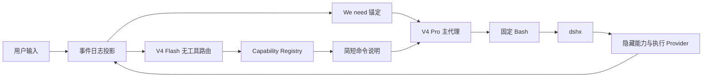

<p align="center">
  <strong>oh-my-dsh</strong>
</p>

<h1 align="center">固定 Minimal 界面，按需加载能力</h1>

<p align="center">DeepSeek Harness preset · Windows 原生 MSYS2 Bash · V4 Flash 能力路由</p>

<p align="center">
  <a href="README.md">English</a> ·
  <a href="docs/plan.md">开发计划</a> ·
  <a href="codemap.md">仓库地图</a> ·
  <a href="NOTICE">NOTICE</a>
</p>

oh-my-dsh 是一个面向 DeepSeek Harness 的实验性 preset。它固定主代理的 Minimal persona 和基础工具界面，把 Windows Bash、能力注册、Flash 路由和长程恢复放在运行层。主代理需要扩展能力时仍然通过 Bash 调用 `dshx`，不会看到完整 Standard 工具目录。

## 项目定位

系统围绕一份稳定的模型交互契约组织：

| 组成 | 作用 |
| --- | --- |
| Minimal 模型平面 | 保留官方 persona、基础工具和请求前缀。 |
| Session Event Log | 保存用户、插件、排队、steering、resume、路由和子代理事实。 |
| 编排平面 | 由无工具的 V4 Flash 子代理选择能力 ID，并生成简短命令说明。 |
| 执行平面 | Linux 使用 Harness Bash，Windows 使用持久 MSYS2 stdio Bash。 |
| WebUI | 源码运行和打包运行都保留 DeepSeek Harness 原生 WebUI。 |

主代理通常只看到三个工具：

| 工具 | 用途 |
| --- | --- |
| `bash` | 持久 Bash 终端。 |
| `str_replace_editor` | 官方 Minimal 文件编辑契约。 |
| `web_search` | 常驻网页搜索。 |

Tauri 只负责 Windows 资源打包、启动和安装入口，不提供第二套 headless 对话界面，也不替换 DeepSeek Harness WebUI。

## 上游仓库与复用贡献

本项目 fork 自 [xiaobright/dsh-anchored-standard](https://github.com/xiaobright/dsh-anchored-standard)。上游仓库贡献了经过验证的 Minimal persona、固定工具契约、锚定思路和对照 preset；本仓库直接复用这些基础，并在其上推进事件日志状态推导、Windows MSYS2 执行层、能力注册表、V4 Flash 路由、长程恢复和 Tauri 发布封装。

`zero-anchored-standard/` 保留为历史对照路径，当前默认实现位于 `preset/`。上游项目的原始版权和第三方声明仍以 [`NOTICE`](./NOTICE) 为准。

## 它解决了什么问题？

它解决了什么问题？
1. **解决了windows上运行bush的问题：**
系统通过检测或内置 MSYS2 环境，建立持久的标准流进程。底层保留环境变量与跨调用状态。内部自动映射 Windows 路径至虚拟工作区，严格禁止回退到 PowerShell。
2. **解决了V4 Pro对dsh极简模式的过拟合问题：**
系统冻结模型交互契约，提示词逐字对齐官方设定。原生工具仅保留文件编辑与终端执行。扩展能力全部转化为命令行说明，由子代理在第二轮之后按需在会话中提示，避免增删原生工具定义，以此维持模型的特定推理激活状态。
3. **解决了长程多轮用户输入的情况下的稳定性:**
系统自第二轮起在用户输入前注入固定英文引导句，强制唤醒深度推理。上下文压缩仅保留修改文件与测试结论等客观事实，不追加行为提示词。系统基于事件日志还原状态，保障长程运行的连续性。
4. **解决了工具调用信息的问题:**
后台安排一个v4 flash无思考子代理按需对工具包进行查找，只在包含第二轮之后的每一轮用户刚刚输入之后，将需要的工具转化为简要命令说明注入会话。主代理在终端内调用代理命令完成交互，执行记录沉淀至事件日志，结果以标准文本形式返回，维持了工具界面的固定形态。
5. ***解决了claude.md，agents.md，skills注入的问题： **
   强制在第二轮才注入claude.md，agents.md，skills信息等内容

## 核心机制

### 会话轮次边界

每次新开会话都会在 `initial system prompt` 之后自动发送第一轮固定 context：

```text
We need to treat this message only as the first-round context anchor, not as a user task. We need to carry out a test in this round. We need to be aware that the tool has not yet been enabled. We need to know that the tool will be enabled in the next round. We need to avoid calling Bash, inspecting the repository, inspecting files, or executing commands in this round. We need to wait for the first real user message before taking any action.
```

这条 context 的模型输出完成后，用户输入的第一句话就是第二轮；从这一条用户输入开始，运行时在用户消息前注入固定的：

```text
We need to engage in a high-quality, in-depth thinking on the user input below. We need to think in English and begin every reasoning sentence with ‘We need…’. We need to keep the reasoning internal and return only the final answer to the user. We need to speak Chinese to users.
```

插件消息、排队消息、steering、resume和子代理都从事件日志推导，不依赖进程内轮次计数。初始 context 是插件来源的 `user/message` 事件，不计入真实用户消息；真实用户消息恢复后，锚定计数从事件日志继续。

### 固定模型平面

主代理使用官方 Minimal persona：

```yaml
complete: true
includeRuntimeContext: false
provider: deepseek-official
model: deepseek-v4-pro
reasoningEffort: max
```

`minimal-surface.mjs` 将最终模型工具目录投影为固定 surface。`zero-tool-bootstrap.mjs` 会在首轮 context 请求中将顶层工具目录置空；只有事件日志出现持久化的 `assistant/message` 后，才恢复固定的 `bash`、`str_replace_editor` 和 `web_search`。重启和 resume 通过事件日志恢复这一状态，子代理从首轮开始保留工具。路由失败时保留基础目录，不开放完整 Standard catalog。临时原生工具出口默认关闭，只有显式配置的白名单 bundle 才能进入当前用户轮次。

### V4 Flash 能力路由

路由器每次使用全新、无工具的 `deepseek-v4-flash` 调用。输入是最新用户消息、当前工作阶段、近期工具事实、活动能力和已注册能力 ID；输出经过 schema 校验的能力 ID。路由器只做选择，不写代码、不修改任务计划，也不把路由过程写入主代理上下文。



### Bash 能力胶囊

`preset/capabilities/manifests.mjs` 保存能力清单，`bin/dshx.mjs` 提供主代理在 Bash 内使用的命令入口：

```sh
node bin/dshx.mjs capabilities
node bin/dshx.mjs git review --format json
node bin/dshx.mjs ci inspect --format json
```

能力调用和结果可以通过 `DSH_SESSION_EVENT_LOG` 写入事件日志。主代理看到的是简短的命令说明和标准文本结果，不会看到完整工具 schema。

### Windows 原生 Bash

Windows provider 启动持久 MSYS2 Bash：

```text
bash.exe --noprofile --norc
```

它在多次调用之间保留 `cd`、`export`、函数和后台任务状态；provider 使用持久的非交互标准流进程，避免把命令回显、提示符和无 TTY 警告混入工具结果。provider 把真实 Windows 工作区映射为模型可见的 `/workspace`，并在执行命令前把 `/workspace/...` 反向映射回真实 MSYS2 路径，输出使用 LF，并且不会回退到 PowerShell。provider 启动时显式补齐 `/usr/local/bin:/usr/bin:/bin`，避免 `ls`、`cat`、`find` 等基础命令因宿主 PATH 被覆盖而不可用。provider 按配置、`DSH_MSYS2_BASH`、常见 MSYS2 路径和 Git Bash 路径顺序查找 Bash。

### 事件日志恢复与有界压缩

`preset/events/projections.mjs` 和 `preset/events/recovery.mjs` 以 Session Event Log 为唯一状态来源。恢复内容包括真实用户消息数量、初始 context、已注入锚定、最近路由能力、请求契约、修改文件、测试结论和任务账本。

长会话达到有界 surface 条件后，恢复插件对真实 Harness `Session` 做持久的 surface replacement。替换内容只包含固定上限内的客观事实：用户要求、修改文件、测试结论、活动能力和任务条目，不追加行为提示词。`compaction/start`、`compaction/summary`、替换后的 `user/message` 和 `compaction/end` 都进入同一份事件日志；重启后由 Harness `Session.fromRestore` 和本项目投影重新得到状态。

## 安装与运行

### 从源码运行 DeepSeek Harness WebUI

源码运行保留 DeepSeek Harness 原生 WebUI，并使用 `web` profile 加载 `oh-my-dsh` preset。源码根目录是 `F:\oh-my-dsh`：

```powershell
$repo = 'F:\oh-my-dsh'
Set-Location (Join-Path $repo 'desktop\runtime')
npm install

$env:DSH_HOME = Join-Path $repo '.dsh-home'
$env:DSH_CWD = $repo
$env:DSH_MSYS2_BASH = Join-Path $repo 'msys64\usr\bin\bash.exe'
$presetTarget = Join-Path $env:DSH_HOME '.agent-presets\oh-my-dsh'
New-Item -ItemType Directory -Force -Path $presetTarget | Out-Null
Copy-Item -Recurse -Force -Path (Join-Path $repo 'preset\*') -Destination $presetTarget

node (Join-Path $repo 'desktop\runtime\node_modules\@deepseek-ai\dsh\lib\bin.js') `
  web `
  --patch (Join-Path $repo 'desktop\web-profile-patch.yml') `
  --host 127.0.0.1 `
  --port 3080
```

启动后访问 `http://127.0.0.1:3080`。Windows 源码运行需要准备 `F:\oh-my-dsh\msys64`；如果 MSYS2 位于其他目录，将 `DSH_MSYS2_BASH` 改为对应安装目录下的 `usr\bin\bash.exe`。

### 只安装 preset 到已有 Harness

```powershell
$target = Join-Path $env:USERPROFILE '.dsh\.agent-presets\oh-my-dsh'
if (Test-Path -LiteralPath $target) { throw "Preset already exists: $target" }
New-Item -ItemType Directory -Force -Path (Split-Path -Parent $target) | Out-Null
Copy-Item -Recurse -Path 'F:\oh-my-dsh\preset\*' -Destination $target
```

需要让 Bash 代理按名称调用 `dshx` 时，在源码根目录执行 `npm link`。启动 Harness 前可设置：

```powershell
$env:DSH_CWD = 'F:\oh-my-dsh'
$env:DSH_MSYS2_BASH = 'F:\oh-my-dsh\msys64\usr\bin\bash.exe'
$env:DSH_ROUTER_PROVIDER = 'deepseek-official'
$env:DSH_ROUTER_MODEL = 'deepseek-v4-flash'
```

### Windows Tauri 打包

Tauri 只负责启动、打包和安装，不替换 DeepSeek Harness WebUI。安装包包含 `oh-my-dsh` preset、`dshx`、DeepSeek Harness `web` profile、便携 Node.js 和 MSYS2 Bash 环境。

```powershell
Set-Location F:\oh-my-dsh\desktop
npm install
npm run prepare:resources
node node_modules\@tauri-apps\cli\tauri.js build --bundles nsis
```

启动 Tauri 后选择工作区，程序会启动同一个 DeepSeek Harness `web` profile，然后在窗口中打开原生 WebUI。EXE 位于 `desktop/src-tauri/target/release/`，NSIS 安装包位于 `desktop/src-tauri/target/release/bundle/nsis/`。

## 开发与验证

仓库根目录的核心测试使用 Node.js 内置测试运行器；恢复测试会创建真实 DeepSeek Harness `Session`，写入 JSONL，再通过 `Session.fromRestore` 恢复，不使用仅返回预设结果的假 session：

```powershell
Set-Location F:\oh-my-dsh
npm test
npm run check
```

源码 WebUI 的实际启动验证：

```powershell
Set-Location F:\oh-my-dsh\desktop\runtime
npm install
```

然后按“从源码运行 DeepSeek Harness WebUI”启动；没有模型凭据时，WebUI 仍应启动并记录固定 context，模型请求会在事件日志中记录 provider 的凭据错误。

## 仓库结构

| 路径 | 内容 |
| --- | --- |
| `preset/` | 可安装 Harness composition、Minimal surface、锚定、路由、能力、恢复和执行 provider。 |
| `preset/anchor/` | 首轮固定 context 与第二轮起的 `We need` 注入。 |
| `preset/events/` | 事件投影、事实压缩、Session surface replacement 和恢复状态。 |
| `preset/router/` | Flash 路由快照、schema、缓存和事件日志回退。 |
| `preset/capabilities/` | 能力 manifest、注册表和临时原生工具出口。 |
| `preset/shell/` | Windows 路径映射和持久 Bash 辅助逻辑。 |
| `bin/dshx.mjs` | 主代理通过 Bash 调用的能力 CLI。 |
| `desktop/` | Tauri 启动器、原生 WebUI 桥接和打包配置。 |
| `test/` | 模型 surface、事件投影、恢复、路由、能力和 Windows Bash 测试。 |
| `docs/plan.md` | 开发计划和验收标准。 |
| `zero-anchored-standard/` | 早期对照 preset。 |

## 运行边界

外部模型调用仍需要 DeepSeek Harness 的 provider 配置和凭据。MSYS2、Node 和 Harness runtime 可以随 Windows 安装包携带，但模型凭据不会写入仓库。源码 WebUI 和 Tauri WebUI 使用同一个 DeepSeek Harness host，Tauri 不维护另一套会话状态。

## 许可证与第三方代码

项目采用 MIT License。`preset/agent.cordis.yml` 复用了 DeepSeek Harness 官方 Minimal 组合，上游仓库的原始版权和第三方声明保留在 [`NOTICE`](./NOTICE) 中。
