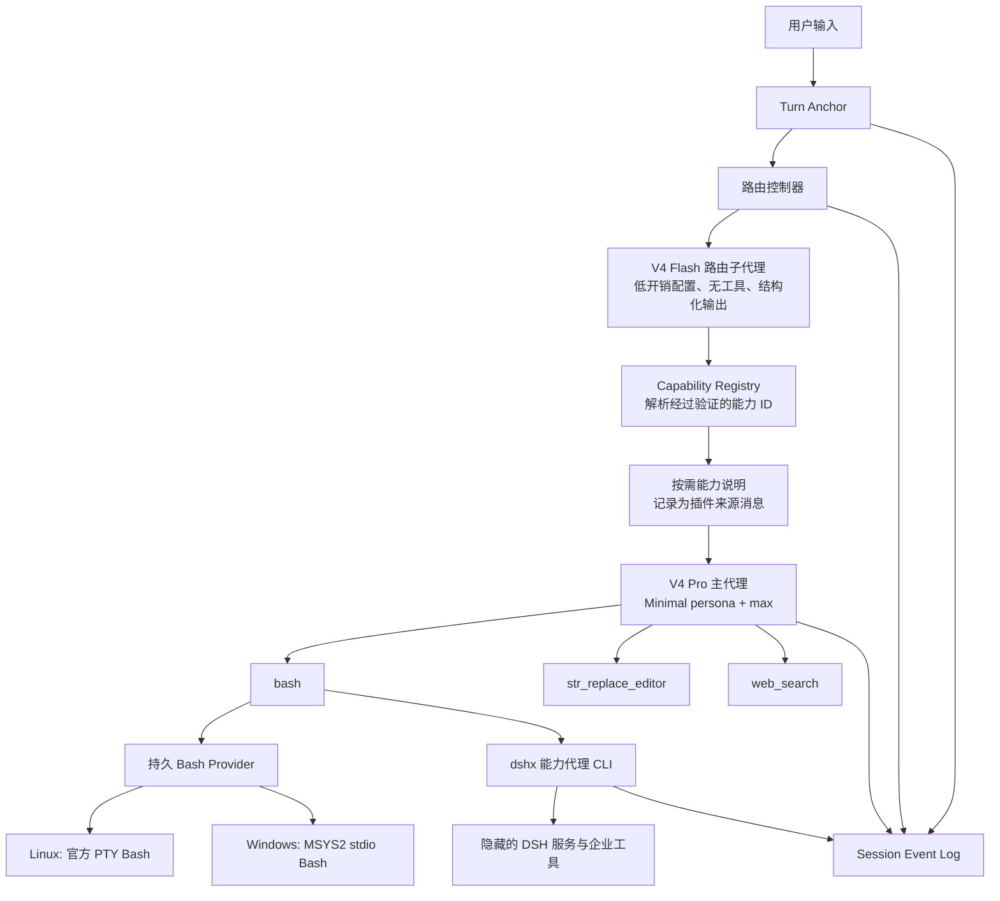

# oh-my-dsh 插件完整开发计划

结论：采用“Minimal 固定模型界面 + Linux-shaped 执行层 + 隐藏式工具路由子代理 + Bash 能力胶囊”架构。

主代理在整个会话中维持最接近官方 `Linux + DSH + Minimal` 的输入形态。Standard 能力放在运行层，需要时由 DeepSeek V4 Flash 路由子代理选择，再以 Bash 命令说明或极少量临时原生 schema 交给主代理。这样既能保持 V4 Pro 的过拟合激活状态，也能覆盖一次性交付、长期测试修复循环和企业级流程。

本计划不会引入 Superpowers 流程。

## 一、现有方案的取舍

参考 [资料.md](F:/AI视频/资料.md) 的构建范式，插件应遵守四条不变量：

- 能力通过 Cordis capability seam 组合，不建立不可替换的插件核心。
- 所有模型可见内容进入 Session Event Log，可以恢复和解释。
- 工具、路由器、Windows 执行器都拥有独立生命周期，卸载后撤销自己的注册。
- 模型行为策略与工具执行机制分开，主代理不感知底层 Windows、MSYS2 或工具路由过程。

从 [dsh-anchored-standard README](F:/oh-my-dsh/dsh-anchored-standard/README.zh-CN.md) 保留：

- 与 Minimal 逐字一致的 persona。
- `complete: true` 和 `includeRuntimeContext: false`。
- 在 `system-prompt/assemble` 阶段控制模型可见工具。
- 从持久 Session Event 推导状态，保证恢复与重载一致。
- 每个会话独立缓存决策。

替换这些机制：

- 取消首轮后晋升完整 Standard。
- 取消 Windows 的 `pwsh/read` 分支。
- 取消 `agent-instructions` 自动注入。
- 取消零工具合成首轮。
- 路由失败时保持 Minimal 基础工具，不开放完整目录。
- 工具目录尽量保持不变，避免反复破坏推理轨迹和请求前缀缓存。

现有 [tool-bootstrap.mjs](F:/oh-my-dsh/dsh-anchored-standard/preset/tool-bootstrap.mjs) 的事件状态和组装过滤方式可以复用，`full catalog exposed` 的降级策略需要改掉。

## 二、推荐架构

````

````

### 模型平面

主代理固定看到：

```
System:
You are a helpful software engineer assistant.

Tools:
bash
str_replace_editor
web_search
```

`bash` 和 `str_replace_editor` 的名称、描述、schema、参数顺序与官方 Minimal 保持一致。`web_search` 是唯一常驻的额外原生工具。

官方 Minimal 配置可直接作为契约快照，见 [官方 agent.cordis.yml](C:/Users/JonahWu/AppData/Local/npm-cache/_npx/1e7f6d9597241db0/node_modules/@deepseek-ai/dsh/config/agent-presets/minimal/agent.cordis.yml)。

主代理默认配置：

```
provider: deepseek-official
model: deepseek-v4-pro
reasoningEffort: max
```

运行期间不切 persona、不切工具呈现模式，也不加入 Standard 的计划模式系统提示词。

### 编排平面

路由子代理独立运行：

```
provider: deepseek-official
model: deepseek-v4-flash
profile: off
maxTokens: 2048
tools: []
context: fresh
output: structured-json
```

```
model: deepseek-v4-flash
reasoningEffort: off
maxTokens: 2048
```

路由子代理只负责能力选择，不写代码、不修改任务计划，也不向主代理发表建议。输入是压缩后的 `RouterSnapshot`：

```
{
  "latest_user_input": "...",
  "current_phase": "implement|test|repair|review",
  "recent_tool_facts": [],
  "active_capabilities": [],
  "available_capability_ids": []
}
```

输出限定为：

```
{
  "capabilities": ["git.review", "ci.inspect"],
  "ttl": "turn",
  "reason": "short classifier reason"
}
```

宿主只接受 Registry 中存在的 ID。小模型不能自行生成工具 schema 或命令说明。

## 三、工具按需开放机制

推荐使用三层能力系统。

### 第一层：Minimal 原生能力

始终存在：

- `bash`
- `str_replace_editor`
- `web_search`

绝大多数编程任务通过 Bash 已经可以完成，包括 Git、构建、测试、进程管理、包管理和脚本执行。这一层完全不改变工具目录。

### 第二层：Bash 能力胶囊

Capability Registry 保存经过人工定义的命令说明，例如：

```
git.review
ci.inspect
task.ledger
subagent.spawn
workflow.run
mcp.call
artifact.publish
```

路由器判断需要某项能力后，插件把对应的简短说明注入主代理：

```
Available capability: ci.inspect
Use:
  dshx ci inspect --format json
Output:
  JSON containing checks, status and relevant logs.
```

主代理仍通过 `bash` 调用，API 工具目录不会变化。

`dshx` 是宿主与 DSH service seam 之间的桥接命令。它可以调用 goal、todo、subagent、workflow、MCP 或企业系统能力，并记录：

```
oh-my-dsh/capability-call
oh-my-dsh/capability-result
```

工具输出再作为 Bash 结果返回主代理。

### 第三层：临时原生工具

只给无法合理通过 Bash 胶囊表达的工具使用，例如需要特殊 UI 卡片或交互协议的工具。

规则：

- 默认关闭。
- 路由器只能选择白名单 bundle。
- 一次只加入需要的 schema。
- 同一用户轮次内单调增加，避免反复加载、卸载。
- 下一轮回到基础目录，重新判断。
- 失败时保持基础目录，禁止开放完整 Standard。

这一层属于兼容出口，不是主路径。

## 四、`We need` 多轮锚定

固定文本逐字保存：

```
We need to engage in a high-quality, in-depth thinking on the user input below. We need to think in English and begin every reasoning sentence with ‘We need…’. We need to keep the reasoning internal and return only the final answer to the user. We need to speak Chinese to users.
```

注入规则：

1. 每次新开会话在 `initial system prompt` 之后自动发送固定第一轮 context：
   `We need to carry out a test in this round. We need to be aware that the tool has not yet been enabled. We need to know that the tool will be enabled in the next round.`
2. 该 context 的模型输出结束后，用户第一次输入即为第二轮，并在该用户消息前注入一次固定文本。
3. 从第二轮开始，每一条用户输入都恰好注入一次。
4. 锚定消息必须紧邻真实用户消息，位于它的前面。
5. 插件消息、工具结果、路由结果、子代理消息不触发锚定。
6. 顶层主代理启用，路由子代理和其他工作子代理不启用。
7. Resume 后从持久事件统计初始 context 与真实用户消息，避免重复注入。
8. 多条用户消息排队时，每条分别匹配自己的锚定消息。

推荐在 `agent/pre-step` 中重排即将进入步骤的消息，而不继续沿用 `agent/inbox/inserted + prepend`。这样可以处理队列、steering 和并发插入，并保证最终顺序：

```
工具能力说明（存在时）
We need 锚定
用户真实输入
```

初始 context、锚定和能力说明都以插件来源的 `user/message` 落入事件日志。初始第一轮保持：

```
Minimal persona
固定基础工具 schema
用户真实输入
```

## 五、Windows 原生最高贴近方案

Windows 用户不需要 WSL 或虚拟机。插件携带或检测便携版 MSYS2，Git Bash 只作为后备选项。

### Windows 持久 Bash Provider

实现新的 stdio 持久 Bash 后端：

```
bash.exe --noprofile --norc
```

Node 使用 `child_process.spawn()` 保持一个长期进程，通过 stdin/stdout 和随机开始、结束标记分隔命令。

需要支持：

- `cd`、`export`、shell 函数跨调用保留。
- 后台任务跨调用保留。
- 工作区统一显示为 `/workspace`。
- Windows 路径只在 Provider 内部转换。
- 输出统一为 LF。
- 非零退出使用 `[exit code: N]`。
- 超时、取消、shell 退出后的提示与官方持久 Bash一致。
- 环境中不出现 PowerShell 命令说明。
- 禁止静默回退 `pwsh`，否则模型输入形态会发生变化。

这条路径绕过 rc.6 在 Windows 上不支持的 PTY 前台进程检查，同时复刻 `dsh-tool-bash-persistent` 的模型接口。

## 六、任务运行方式

### One-shot

- 首轮固定 context 保持基础 Minimal 表面。
- 主代理直接读取、修改、构建和测试。
- 路由器在后续步骤发现特殊能力需求时加载胶囊。
- 成功标准是产物和验证结果在当前用户轮次内交付。

### 长时间闭环

主代理持续掌握任务，宿主只维护事实状态：

```
计划
→ 落地
→ 测试
→ 读取失败事实
→ 修复
→ 重新测试
```

计划和任务进度通过 `dshx task` 或工作区文件保存，工具目录不切换。路由器可以在测试失败、CI 失败、需要评审等新状态出现后重新判断能力。

长会话压缩保持 Minimal 前缀不变。摘要作为有来源的历史事实进入日志，保留：

- 用户要求与验收标准。
- 当前计划和已完成项。
- 修改过的文件。
- 测试结果与未解决问题。
- 当前已启用能力。

摘要不加入新的行为提示词。

### 企业级流程

企业能力继续走 capability seam：

- 代码库、Issue、CI、评审、发布分别由 Provider 提供。
- 主代理通过 `dshx` 使用这些能力。
- Reviewer、测试分析或仓库扫描可以使用独立工作子代理。
- Flash 路由子代理只选择能力，不承担工程工作。
- 现有 DSH approval、sandbox、session persistence 保留在宿主层，不污染 Minimal persona。

## 七、建议的项目结构

保持单 npm 包，避免一开始拆成多个独立仓库：

```
F:\oh-my-dsh
├─ package.json
├─ src
│  ├─ index.ts
│  ├─ preset
│  │  ├─ agent.cordis.yml
│  │  └─ preset.yml
│  ├─ anchor
│  │  └─ turn-anchor.ts
│  ├─ router
│  │  ├─ controller.ts
│  │  ├─ snapshot.ts
│  │  └─ schema.ts
│  ├─ capabilities
│  │  ├─ registry.ts
│  │  ├─ surface.ts
│  │  ├─ broker.ts
│  │  └─ manifests
│  ├─ shell
│  │  ├─ persistent-bash.ts
│  │  ├─ windows-msys2.ts
│  │  └─ path-map.ts
│  └─ events
│     └─ projections.ts
└─ test
   ├─ contract
   ├─ anchor
   ├─ router
   ├─ shell
   ├─ resume
   └─ model-evaluation
```

## 八、开发阶段

### 阶段 1：固定模型契约

- 建立官方 Minimal persona、bash schema、editor schema 的逐字节快照。
- 加入常驻 `web_search`。
- 禁止 agent instructions、runtime context 和 Standard 工具说明。
- 记录每次 `request/header` 的模型契约摘要。

验收：除 `web_search` 外，与官方 Minimal 的模型输入一致。

### 阶段 2：多轮锚定

- 实现首轮跳过、后续逐条注入。
- 支持 resume、queued messages 和 steering。
- 为来源、顺序和重复注入写单元测试。

验收：每条后续真实用户输入前恰好出现一次固定文本。

### 阶段 3：Windows 持久 Bash

- 实现 MSYS2 发现和 `/workspace` 映射。
- 实现 stdio 持久 shell、状态标记、取消和超时。
- 对齐官方输出文本。

验收：Windows 上 `pwd/cd/export/function/background` 跨调用工作，模型历史不出现 Windows 路径或 PowerShell。

### 阶段 4：Capability Registry 与 `dshx`

- 定义 manifest 格式。
- 先实现最必要的 task、subagent、workflow 和 CI 能力。
- 建立调用与结果事件。
- 保证 Provider 卸载后 CLI 能力同步失效。

验收：主代理只通过 Bash 即可使用扩展能力，工具目录保持不变。

### 阶段 5：Flash 路由子代理

- 使用 fresh spawn、空工具过滤和结构化输出。
- 实现 `RouterSnapshot`。
- 缓存相同状态指纹的选择结果。
- Router 失败时沿用上次有效结果或基础能力。
- 禁止回退完整 Standard。

验收：路由过程不会进入主代理历史，只注入 Registry 解析后的能力说明。

### 阶段 6：临时原生工具出口

- 实现白名单 bundle。
- 同一轮次内单调增加。
- 同步约束工具执行面，隐藏工具无法直接调用。
- 默认配置关闭。

验收：目录变化只包含所选工具，不出现 25 项 Standard 快照。

### 阶段 7：长程运行与恢复

- 接入事件投影和有界压缩。
- 恢复锚定计数、路由状态、能力状态和任务账本。
- 验证中断、重启和继续执行。

### 阶段 8：发布

- 兼容 rc.6。
- 提供 Linux、Windows Native 两个执行 Provider。
- 发布 npm 包和可复制 preset。
- README 明确三项配置：主模型、路由模型、Windows Bash 路径。

## 九、测试与最终验收

对比五组：

1. 官方 Linux Minimal。
2. oh-my-dsh Linux。
3. oh-my-dsh Windows Native。
4. anchored-standard Windows。
5. 官方 Standard。

测试任务分为：

- One-shot：读代码、修改、运行测试并交付。
- 闭环任务：计划、实现、注入测试失败、修复、复测。
- 企业流程：多目录修改、CI 诊断、代码评审、子代理协作、恢复会话。

核心指标：

- 首轮 system prompt 和基础 schema 字节一致性。
- 每次请求的工具目录变化次数。
- `We need / let me / the user wants` 推理轨迹统计。
- 首次交付成功率。
- 测试修复闭环完成率。
- Resume 后行为一致性。
- Linux 与 Windows 的命令输出差异。
- Prompt cache 命中量。
- Router 选择准确率和额外时延。

发布门槛：

- 首轮无动态上下文注入。
- 后续锚定零漏注入、零重复。
- 普通编程任务全程只有三个常驻工具。
- Windows 不出现 `pwsh`。
- Router 故障不会开放 Standard。
- 长程任务恢复后可以继续原有测试修复循环。
- Linux 与 Windows 两条路径都通过相同模型契约测试。

这套计划的核心变化是：工具能力继续增长，V4 Pro 看到的 Harness 形态长期保持 Minimal。路由子代理、Windows 兼容层、企业服务都留在主代理视野之外，只把当前确实需要的操作说明送入会话。
